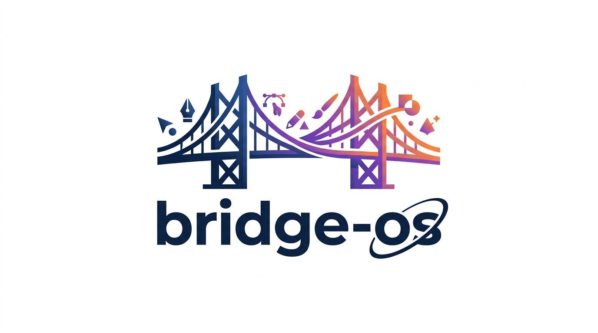

# Bridge OS

<p align="center">
  
</p>


> The missing connection between Design OS and Agent OS.

Bridge OS is the single entry point for AI-first product development. It installs and connects [Design OS](https://github.com/buildermethods/design-os) and [Agent OS](https://github.com/buildermethods/agent-os) — ensuring the design phase always happens before implementation begins.

Now supports **Figma MCP** as an alternative design token source, alongside the full Design OS workflow.

---

## Why Bridge OS

Design OS produces a complete handoff package — components, tokens, user flows, and prompts. Agent OS consumes standards to align the agent before building. The problem: neither tool knows the other exists, and every new project requires installing and wiring both manually.

Bridge OS fills that gap:

- **One entry point** — a single `curl` installs Bridge OS, which then sets up everything else
- **Single session** — Design OS, Bridge OS, and Agent OS commands all run from one Claude Code session
- **Two design paths** — pull tokens from Figma MCP or use the full Design OS interactive workflow
- **Enforced order** — a phase lock prevents Agent OS from running without completed design tokens
- **Automatic translation** — design tokens become a `design-system.md` standard that Agent OS reads automatically
- **Full lifecycle** — `/bridge-evolve` handles adding sections, redesigning, and updating tokens post-build

---

## How it works

```
curl ... | bash          ← install Bridge OS globally (once)
       ↓
/bridge-init             ← install Design OS + Agent OS + configure project
                           (optional: set up Figma MCP)
       ↓
/bridge-design           ← choose design source, then complete design phase
       │
       ├── Path A: Figma MCP  → pull tokens from Figma variables
       └── Path B: Design OS  → full interactive design workflow
       ↓
/bridge-sync             ← connect tokens/export to Agent OS standards
       ↓
/bridge-build            ← inject standards + shape specs per section
       ↓
build                    ← agent builds with full design context
       ↓
/bridge-evolve           ← add sections, redesign, or update tokens
```

### What happens during sync

**Path A — Figma MCP:**
```
.bridge-os/figma-tokens.json       agent-os/standards/global/
  colors[]                     →     design-system.md  (tokens + rules)
  typography[]                 →
  spacing[]                    →
agent-os/product/overview.md   →   agent-os/product/design-requirements.md
```

**Path B — Design OS:**
```
bridge-design/product-plan/        agent-os/standards/global/
  design-system/               →     design-system.md  (tokens + components + rules)
  sections/                    →
  shell/                       →
  product-overview.md          →   agent-os/product/design-requirements.md
```

---

## Requirements

- Node.js v18+
- Git
- [`yq`](https://github.com/mikefarah/yq) _(optional but recommended)_
- Figma account _(optional — only for Path A / Figma MCP)_

> Design OS and Agent OS do not need to be installed manually.
> `/bridge-init` handles everything automatically.

---

## Installation

### 1. Install Bridge OS globally — one command, one time

```bash
curl -sSL https://raw.githubusercontent.com/franciscorodriguezsv24/bridge-os/main/setup/install.sh | bash
```

This sets up `~/.bridge-os/` on your system. You only need to do this once.

### 2. Set up your project

```bash
# Create your project
npx create-next-app@latest my-project --typescript --tailwind --app --src-dir
cd my-project

# Bootstrap Bridge OS commands (required once to make /bridge-init available)
~/.bridge-os/setup/project.sh

# Open Claude Code
claude
```

### 3. Let Bridge OS take it from here

```
/bridge-init
```

This installs Design OS, Agent OS, and wires everything together.
Optionally configures Figma MCP if you choose Path A.

---

## Commands

| Command | Phase | What it does |
|---------|-------|-------------|
| `/bridge-init` | Setup | Installs Design OS + Agent OS + configures the project. Optional Figma MCP setup. |
| `/bridge-design` | Design | Choose Figma MCP or Design OS, then complete the full design phase |
| `/bridge-sync` | Bridge | Syncs tokens/export to Agent OS standards (routes by design source) |
| `/bridge-build` | Build | Injects standards and shapes a spec for each roadmap section |
| `/bridge-evolve` | Evolve | Add sections, redesign, or update tokens after initial build |
| `/bridge-status` | Any | Shows current phase and verifies all checks |

All Bridge OS and Agent OS commands are installed automatically into
`.claude/commands/` during project setup.

---

## Usage

### Full flow — new project

```
/bridge-init      ← installs everything (+ optional Figma MCP setup)
/bridge-design    ← choose Path A (Figma) or Path B (Design OS)
/bridge-sync      ← connects tokens to Agent OS standards
/bridge-build     ← injects standards + shapes specs per section
                  ← build
```

### Figma MCP path (Path A)

If you already have your design in Figma and want to use tokens directly:

```
/bridge-design    ← choose "A) Figma MCP"
                  ← Bridge OS detects MCP availability
                  ← if not configured: guides you through token + settings setup
                  ← pulls variables from Figma → figma-tokens.json
                  ← guides product vision + roadmap by conversation
/bridge-sync      ← sync.sh --figma → generates design-system.md
/bridge-build     ← shapes specs using Figma token standards
```

Re-syncing after Figma token updates:
```bash
.bridge-os/sync.sh --figma              # full re-sync
.bridge-os/sync.sh --figma --tokens-only # tokens only
```

### Design OS path (Path B)

```
/bridge-design    ← choose "B) Design OS"
                  ← vision → roadmap → tokens → shell → sections → export
/bridge-sync      ← connects Design OS export to Agent OS
/bridge-build     ← shapes specs using exported components + tokens
```

### Adding sections or updating the design post-build

```
/bridge-evolve    ← add sections, redesign, update tokens, or update data shape
```

### Partial syncs (Design OS path)

```bash
.bridge-os/sync.sh --tokens-only      # only tokens changed
.bridge-os/sync.sh --section dashboard # one section redesigned
.bridge-os/sync.sh --dry-run           # preview without writing
```

### Updating after a Bridge OS release

```bash
cd ~/.bridge-os && git pull origin main
cd your-project
~/.bridge-os/setup/project.sh --update  # refreshes scripts + all commands
```

---

## Project structure

After setup, your project will look like this:

```
your-project/
├── bridge-design/              ← Design OS repo (git-ignored, Path B only)
│   └── product-plan/           ← generated by /export-product
│       ├── design-system/      ← tokens.css, tailwind-colors.css, fonts.md
│       ├── sections/           ← section components
│       ├── shell/              ← app shell and navigation
│       ├── prompts/            ← one-shot-prompt.md, section-prompt.md
│       └── product-overview.md
├── agent-os/                   ← Agent OS
│   ├── standards/global/
│   │   └── design-system.md   ← generated by Bridge OS sync
│   └── product/
│       ├── design-requirements.md
│       └── roadmap.md
├── design-export/              ← copy of Design OS export (git-ignored, Path B)
├── .bridge-os/                 ← Bridge OS config and scripts
│   ├── config.yml              ← local config (git-ignored)
│   ├── state.json              ← current phase + design_source (git-ignored)
│   ├── figma-tokens.json       ← Figma variables cache (git-ignored, Path A)
│   ├── sync.sh
│   ├── generate-standard.js
│   └── generate-figma-standard.js
├── .claude/
│   └── commands/
│       ├── bridge-init.md
│       ├── bridge-design.md
│       ├── bridge-build.md
│       ├── bridge-evolve.md
│       ├── bridge-status.md
│       ├── bridge-sync.md
│       └── design-os/          ← Design OS commands (copied by /bridge-init)
│           ├── product-vision.md
│           ├── product-roadmap.md
│           ├── data-shape.md
│           ├── design-tokens.md
│           ├── design-shell.md
│           ├── shape-section.md
│           └── export-product.md
└── src/                        ← your app code
```

---

## Troubleshooting

### Figma MCP not responding

If Bridge OS reports Figma MCP is not available:

1. Verify `~/.claude/settings.json` contains the Figma MCP config:

```json
{
  "mcpServers": {
    "Figma": {
      "command": "npx",
      "args": ["--yes", "figma-developer/mcp", "--stdio"],
      "env": {
        "FIGMA_ACCESS_TOKEN": "figd_xxxxxxxxxxxx"
      }
    }
  }
}
```

2. Check your token at [figma.com](https://www.figma.com) → Settings → Security → Personal access tokens
   - Token must have **File content (Read)** scope

3. Restart Claude Code completely: `Cmd+Q` → reopen terminal → `claude`

Run `/bridge-design` again — Bridge OS will guide the full setup if MCP is still missing.

---

### `bash: line 1: 404:: command not found` when installing Agent OS

The Agent OS install script URL changed in v3. Use the correct URL:

```bash
curl -sSL "https://raw.githubusercontent.com/buildermethods/agent-os/main/scripts/base-install.sh" | bash
```

Note: Agent OS v3 installs to `~/agent-os/` (no dot), not `~/.agent-os/`.

---

### `permission denied: ~/.bridge-os/setup/project.sh`

Git does not always preserve execute permissions when cloning.
Fix it manually:

```bash
chmod +x ~/.bridge-os/setup/project.sh
chmod +x ~/.bridge-os/setup/install.sh
chmod +x ~/.bridge-os/scripts/sync.sh
```

Then re-run `~/.bridge-os/setup/project.sh`.

---

### `🚫 PHASE LOCK: Design OS export not found`

Bridge OS cannot find the Design OS export. This only applies to Path B (Design OS).

1. Verify `export_dir` in `.bridge-os/config.yml` — it should be `product-plan`
2. Make sure you ran `/export-product` in Design OS before syncing

```yaml
design_os:
  path: "./bridge-design"
  export_dir: "product-plan"   # ← not "export"
```

If using Path A (Figma MCP), run `.bridge-os/sync.sh --figma` instead.

---

### `⚠ Incomplete export. Missing: ...`

The export folder exists but is missing required files.
Re-run `/export-product` in Design OS to regenerate the full package.

---

### `tokens: none` in sync output

Bridge OS could not read the token files. Verify that
`design-export/design-system/tokens.css` exists and is not empty.

---

### `/bridge-status` shows old checks after update

```bash
~/.bridge-os/setup/project.sh --update
```

---

## What Bridge OS does not do

- Does not modify Design OS or Agent OS source code
- Does not generate application code
- Does not replace any Design OS or Agent OS commands — it orchestrates them
- Does not require Figma — Design OS path works fully offline

It installs, connects, and enforces order between the two tools — nothing more.

---

## Contributing

Contributions are welcome. Please read [CONTRIBUTING.md](CONTRIBUTING.md) before opening a PR.

---

## Changelog

See [CHANGELOG.md](CHANGELOG.md) for version history.

---

## License

MIT — see [LICENSE](LICENSE).

Built to work alongside [Design OS](https://github.com/buildermethods/design-os) and [Agent OS](https://github.com/buildermethods/agent-os) by [Brian Casel](https://buildermethods.com).
